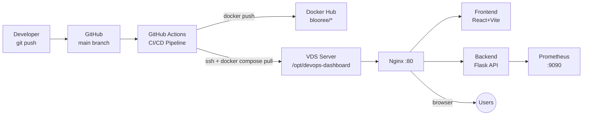

# ⚡ DevOps Dashboard


Real-time server monitoring dashboard with a fully automated CI/CD pipeline.
Every push to `main` builds new Docker images, pushes them to Docker Hub, and
redeploys the stack on your VDS — zero manual steps required.

**Live demo:** http://YOUR_VDS_IP

---

## Screenshots

> _Replace with actual screenshots after first deployment._

```
┌─────────────────────────────────────────────┐
│  ⚡ DevOps Dashboard   [YOUR_VDS_IP]   ● Live │
├──────────┬──────────┬──────────┬────────────┤
│ 🖥 CPU   │ 💾 Memory│ 💿 Disk  │ 🌐 Network │
│  23%     │  67%     │  45%     │  1240 MB   │
├──────────┴──────────┼──────────┴────────────┤
│  CPU History        │  Memory History        │
│  ~~^~~~^~~          │  ▓▓▓▓▓▓▓▓▓▓           │
├─────────────────────┼───────────────────────┤
│  ⏱ Uptime           │  🚀 Deployments        │
│  05d 03h 12m 07s    │  ● abc1234  success   │
└─────────────────────┴───────────────────────┘
```

---

## Architecture



---

## Tech Stack

| Layer | Technology |
|-------|-----------|
| Frontend | React 18, Vite, Recharts, date-fns |
| Backend | Python 3.11, Flask 3, psutil, APScheduler, Gunicorn |
| Proxy | Nginx (alpine) |
| Monitoring | Prometheus v2.48 |
| Containers | Docker + Docker Compose |
| CI/CD | GitHub Actions |
| Registry | Docker Hub |

---

## Prerequisites

- Docker ≥ 24 + Docker Compose plugin ≥ 2
- Node.js 20 (local dev only)
- Python 3.11 (local dev only)

---

## Quick Start (local)

```bash
git clone https://github.com/Blooree/devops-dashboard.git
cd devops-dashboard
cp .env.example .env          # adjust if needed
make up                        # builds & starts everything
open http://localhost          # dashboard
open http://localhost:9090     # prometheus
```

---

## API Reference

| Method | Path | Description |
|--------|------|-------------|
| `GET` | `/api/health` | Health check — returns `{"status":"ok","version":"..."}` |
| `GET` | `/api/metrics` | Current server metrics snapshot |
| `GET` | `/api/history` | Last 60 metric snapshots (1 per minute) |
| `GET` | `/api/deployments` | Last 10 deployment events |
| `POST` | `/api/deployments/register` | Record a deployment event (called by CI) |

### POST /api/deployments/register body

```json
{
  "commit": "abc1234",
  "message": "feat: add uptime counter",
  "author": "Blooree",
  "status": "success",
  "duration_sec": 87
}
```

---

## CI/CD Pipeline

```
push to main
    │
    ▼
[test]
  • Python import smoke-test
  • npm ci + npm run build
    │
    ▼
[build-and-push]
  • docker buildx build backend  → blooree/devops-dashboard-backend:latest + :<sha>
  • docker buildx build frontend → blooree/devops-dashboard-frontend:latest + :<sha>
    │
    ▼
[deploy]
  • scp docker-compose.prod.yml + nginx/ + monitoring/ to VDS
  • ssh: docker compose pull && up -d --remove-orphans && prune
  • POST /api/deployments/register (success or failed)
```

Average pipeline time: ~3 minutes.

---

## GitHub Secrets Required

| Secret | Value |
|--------|-------|
| `VDS_HOST` | Your server IP |
| `VDS_USER` | SSH username (`root`) |
| `VDS_SSH_KEY` | Full content of `~/.ssh/id_rsa` |
| `DOCKERHUB_USERNAME` | `blooree` |
| `DOCKERHUB_TOKEN` | Docker Hub access token |

Add them at: **GitHub repo → Settings → Secrets and variables → Actions**

---

## Makefile

```
make up          Start dev stack (build from source)
make down        Stop (keep volumes)
make logs        Follow logs
make status      Container status
make build       Rebuild without cache
make clean       Remove containers + volumes
make prod-up     Start prod stack (pull from Hub)
```

---

## Project Structure

```
devops-dashboard/
├── backend/                Flask API + psutil metrics
│   ├── app.py
│   ├── requirements.txt
│   └── Dockerfile
├── frontend/               React SPA
│   ├── src/
│   │   ├── App.jsx
│   │   └── components/
│   ├── index.html
│   ├── package.json
│   ├── vite.config.js
│   └── Dockerfile
├── nginx/nginx.conf        Reverse proxy config
├── monitoring/             Prometheus config + alerts
├── .github/workflows/      GitHub Actions CI/CD
├── docker-compose.yml      Local dev
├── docker-compose.prod.yml Production (Hub images)
├── Makefile
└── .env.example
```
